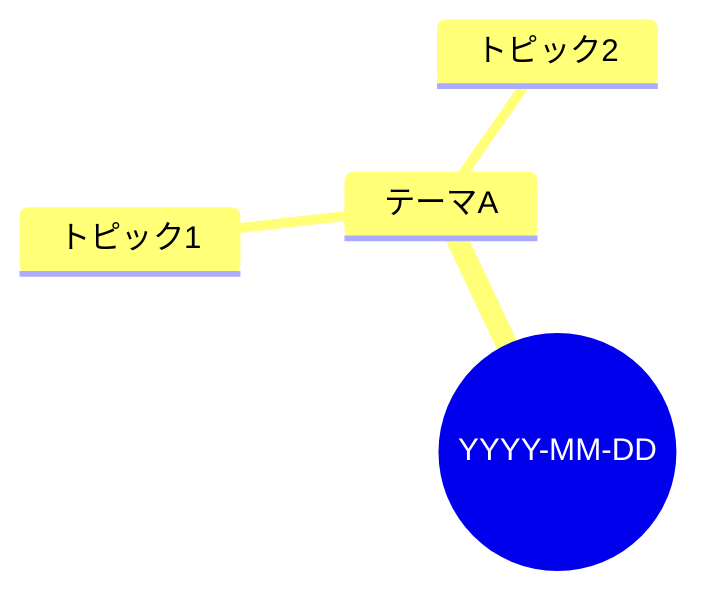

# Intel Digest — 日次収集・要約

コンソール（`$INTEL_API_URL`）のソースマスタに定義された全ソースから直近24時間の情報を集め、トピック別に統合・要約・図解してコンソールへ登録する。承認なしで最後まで自動実行する。

## 前提（環境変数）

| 変数 | 必須 | 用途 |
|---|---|---|
| `INTEL_API_URL` / `INTEL_API_KEY` | ✅ | コンソール API。ルーティンでは claude.ai の環境変数、ローカルでは `.env.local` から（`scripts/*.mjs` / `notify.sh` が自動で読む。Bash から直接 `curl` する場合は `set -a; source .env.local; set +a`） |
| `XAI_API_KEY` | – | X アカウント / X トレンド収集。未設定なら X 系をスキップして続行 |
| `DIGEST_LANG` | – | `ja`（既定）/ `en`。ダイジェストの言語 |
| `DIGEST_TZ` | – | 既定 `Asia/Tokyo`。日付判定に使う |
| `NOTIFY_*` / `LINE_CHANNEL_*` | – | 通知先。未設定なら通知をスキップ |
| `DIGEST_COMMIT_LOGS` | – | `1` のとき `digests/YYYY-MM-DD.md` を commit/push する |

作業ファイルは `.work/` に置く（gitignore 済み）。`mkdir -p .work`。

## 手順

### Step 0: 日付と疎通

```bash
TZ="${DIGEST_TZ:-Asia/Tokyo}"; TODAY=$(TZ=$TZ date +%F); YESTERDAY=$(TZ=$TZ date -d "yesterday" +%F 2>/dev/null || TZ=$TZ date -v-1d +%F)
node scripts/post.mjs health
```

health が `ok: false` または到達不能なら、原因（URL / キー / ネットワーク制限）を報告して終了する。**書き込み系 API にダミーデータを送って確かめない。**

### Step 1: ソースマスタ

```bash
node scripts/post.mjs sources > .work/sources.json
```

`sources.x_accounts / x_trends / rss / releases` の `status: active` を種別ごとに列挙する。API が使えないときのフォールバックは `sources.json`（あれば）→ `sources.example.json`。active が 0 件なら報告して終了。

### Step 2: 収集（並列）

以下を **並列** に実行し、結果を `.work/` に保存する。

**RSS + OSS リリース**（依存ゼロのパーサ。24時間以内の記事のみ。リリースは初回や低頻度リポなら `--hours 168` で 7 日まで許容）:
```bash
node scripts/fetch-rss.mjs --from-sources .work/sources.json --hours 24 > .work/rss.json
```
`ok: false` のフィードは失敗として記録し続行。**新リリースがあれば必ずダイジェストのトピックに含める**（重要 OSS の更新を見逃さない）。

**X アカウント**（`XAI_API_KEY` がある場合のみ。active な handle をまとめて 1 回、10 件を超えるなら分割）:
```bash
python3 tools/xai-search/search.py \
  "以下のアカウントの直近24時間の投稿から、重要な発表・知見をリストアップしてください。各項目に要約とポストURLを含めてください" \
  --from $YESTERDAY --to $TODAY --handles handle1,handle2,... > .work/x-accounts.txt
```

**X トレンド**（active な query ごとに 1 回）:
```bash
python3 tools/xai-search/search.py "{query}" --from $YESTERDAY --to $TODAY > .work/x-trend-N.txt
```

失敗したソースは記録して続行（全滅のときだけエラー終了）。

収集した全アイテムを要約とは別に生データ JSON `.work/raw.json` にまとめる（ダイジェストに採用しなかったものも全件）:
```json
{"date":"YYYY-MM-DD","collected_at":"YYYY-MM-DDTHH:MM+09:00",
 "items":[{"source":"Hacker News","kind":"rss","title":"...","url":"...","published":"..."}],
 "failures":[{"source":"...","kind":"rss|x_account|x_trend|release","reason":"..."}]}
```
`kind` は `rss` | `x_account` | `x_trend` | `release`。

### Step 3: トピック統合・要約

1. 同一の出来事を 1 トピックに統合（複数ソースに登場 = 重要度が高い）
2. 重要度順に **5〜10 トピック** を選定
3. 各トピック: 要点（2〜3 行）/ 出典リンク（複数可）/ コメント（背景・意義・インパクトを 1〜2 文）

**公開前提で書く**: 通知先が共有チャネルでも安全なように、利用者固有の非公開情報（社名・内部プロジェクト・内部 URL・数値目標など）はダイジェストに書かない。要約は元テキストのコピペではなく自分の言葉で。言語は `DIGEST_LANG`（既定: 日本語）。

### Step 4: Mermaid 図解

冒頭に当日の全体像を俯瞰する Mermaid 図を 1 つ入れる。基本は `mindmap`（中心=日付、枝=テーマ、葉=トピック）。トピック間に因果・連鎖があれば `flowchart LR` を追加してよい。**ノードテキストに `(` `)` `[` `]` `{` `}` を含めない**（描画エラー防止）。

### Step 5: 保存

`.work/YYYY-MM-DD.md` に以下の形式で書く。**トピック見出しは必ず `### N. タイトル 【重要度: 高/中/低】`**（LINE Webhook のトピック抽出がこの形式に依存）。

```markdown
---
date: YYYY-MM-DD
sources_ok: N
sources_failed: N
topics: N
---

# Intel Digest: YYYY-MM-DD

## 今日の全体像



## トピック

### 1. トピック名 【重要度: 高】

- **要点**: ...
- **出典**: [ソース名](URL), [ソース名](URL)
- **コメント**: ...

（トピック分繰り返し）

## ソース別収集状況

| ソース | 種別 | 件数 | 状態 |
|--------|------|------|------|

## アクションアイテム

- [ ] [intel] ソース運用に関する提案（追加・停止など）があれば
```

コンソールへ登録（一次ストア）:
```bash
node scripts/post.mjs digest $TODAY .work/$TODAY.md
node scripts/post.mjs raw .work/raw.json
```
POST が失敗したらエラーを記録して続行（Step 6 の通知には失敗を明記）。

`DIGEST_COMMIT_LOGS=1` のときだけ、`digests/$TODAY.md` にコピーして **そのファイルのみ** `git add` → commit（`log(intel): digest YYYY-MM-DD`）→ `git push`。競合したら `git pull --rebase` して再 push。それ以外は commit しない。

### Step 6: 通知（任意）

```bash
bash scripts/notify.sh "📡 Intel Digest $TODAY
1. <トピック1タイトル>【高】
2. <トピック2タイトル>【中】
3. <トピック3タイトル>【中】
→ $INTEL_API_URL/d/$TODAY"
```

通知先が未設定なら自動でスキップされる（エラーにしない）。**手順にある 1 回だけ送る**。動作確認目的の再送はしない（必要なら `NOTIFY_DRY_RUN=1`）。

### Step 7: 結果報告

最後に: 収集ソース数（成功/失敗）、トピック数、トップ 3 の 1 行要約、失敗ソースの詳細、コンソール URL（`$INTEL_API_URL/d/$TODAY`）。

## ソースの追加・停止（利用者から頼まれたとき）

1. `node scripts/post.mjs sources > .work/sources.json`
2. JSON を編集（追加は `status: active` と `added: YYYY-MM-DD`、外すのは削除ではなく `status: paused`）
3. `node scripts/post.mjs sources:put .work/sources.json`
4. 結果を `node scripts/post.mjs sources` で確認して報告

## 注意事項

- 収集は並列に。一部ソースの失敗でジョブを止めない（失敗はレポートに明記 — 棚卸しの判断材料）
- 書き込み系 API（`/api/digests` `/api/raw` `PUT /api/sources`）へダミーデータを送らない
- ダイジェストの言語・分量・トピック数は `docs/CUSTOMIZE.md` の方針に従って変えてよいが、見出し形式（`### N. タイトル 【重要度: …】`）は維持する
